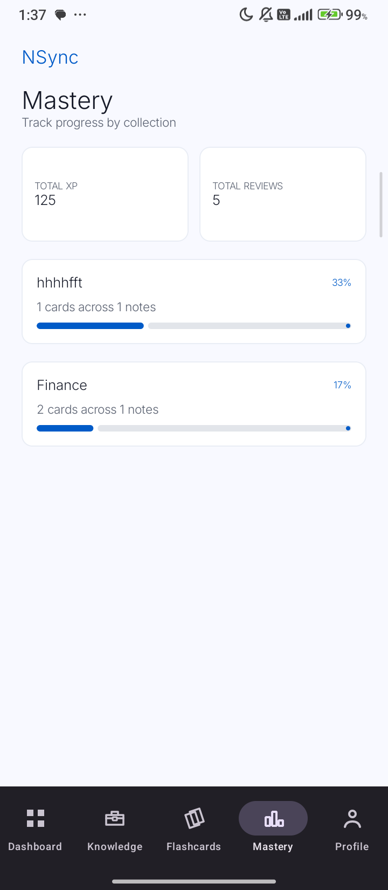
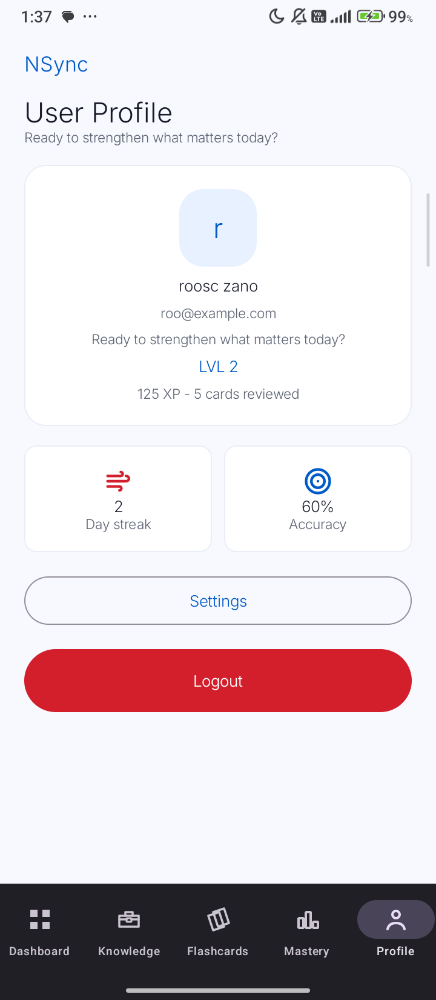
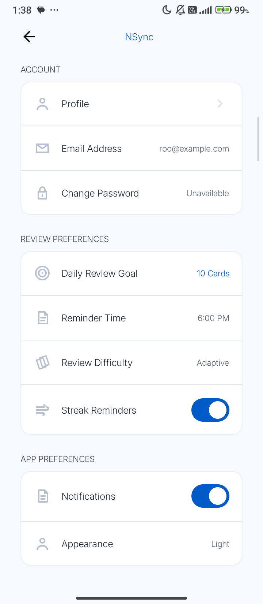

# Name: Roosc Zaño
# Section: M006 - ITWM104
# Professor: Rodrigo Belleza Jr.

# Final Output

## NSync: A Gamified Personal Knowledge and Review App

NSync is a gamified personal knowledge and memory application built with Kotlin and Jetpack Compose. It helps users capture important ideas, organize them into a knowledge base, create review cards, complete quiz-style review sessions, and track learning progress through XP, levels, streaks, accuracy, and mastery.

Unlike the earlier prototype version, the current NSync app now saves user data through a Django REST Framework backend connected to PostgreSQL. The app supports account registration, login, user-specific notes, flashcards, review sessions, progress tracking, profile information, and local review settings.

## Prototype

Prototype link:

```text
https://www.figma.com/design/7H8WBByDjmMm8zUvuCEFgE/NSync
```

## Application Requirements Checklist

| Requirement | Implementation |
| --- | --- |
| Kotlin Android application | The Android app is built with Kotlin. |
| Jetpack Compose UI | Screens are implemented using composable functions and Material 3 components. |
| At least 3 screens | The app includes Login, Register, Dashboard, Knowledge Base, Knowledge Detail, New Note, Flashcards, Review Session, Session Complete, Mastery, Profile, and Settings screens. |
| Navigation between screens | Navigation is handled through `AppNavigation.kt` and `Routes.kt` using Navigation Compose. |
| Multiple composable functions | Each screen is divided into multiple composable functions and reusable components. |
| Separate Kotlin files by functionality | Screens, components, state, repositories, DTOs, navigation, notifications, and theme files are separated into their own folders. |
| Scaffold layout | `Scaffold` is used in shared and individual screens such as `MainScreenScaffold`, `DashboardScreen`, `NewNoteScreen`, and `SessionCompleteScreen`. |
| Saves data locally or on cloud | Data is saved through a Django REST API connected to PostgreSQL. Auth tokens and settings are also saved locally using DataStore and SharedPreferences. |

# Page Screenshots

Save the screenshots using these filenames before exporting to PDF:

```text
docs/screenshots/final/login.png
docs/screenshots/final/register.png
docs/screenshots/final/dashboard.png
docs/screenshots/final/knowledge-base.png
docs/screenshots/final/knowledge-detail.png
docs/screenshots/final/new-note.png
docs/screenshots/final/new-review-card.png
docs/screenshots/final/review-sessions.png
docs/screenshots/final/review-question.png
docs/screenshots/final/review-answer.png
docs/screenshots/final/session-complete.png
docs/screenshots/final/mastery.png
docs/screenshots/final/profile.png
docs/screenshots/final/settings.png
```

## Login Page

Purpose: Allows an existing user to sign in using their email and password. The app stores the returned JWT session so the user can access protected screens.


## Register Page

Purpose: Allows a new user to create an NSync account with a full name, email address, and password.


## Dashboard Page

Purpose: Shows the signed-in user's greeting, level, XP, streak, accuracy, start review action, and recent knowledge.


## Knowledge Base Page

Purpose: Lists saved notes from the backend and lets the user create a new note.


## Knowledge Detail Page

Purpose: Displays the selected note, mastery summary, review-card count, full note content, and actions to start review, add a review card, edit, or delete.


## New Note Page

Purpose: Lets the user create a note by entering a title, collection, source, context, and note content.


## New Review Card Page

Purpose: Lets the user create a flashcard connected to a knowledge note by entering a question, answer, and difficulty.


## Review Sessions Page

Purpose: Groups flashcards into review sessions by their connected knowledge note. Each session can be started or expanded by adding more cards.


## Review Session - Question Page

Purpose: Shows the current review question and lets the user reveal the answer.


## Review Session - Answer Page

Purpose: Shows the answer and lets the user rate recall using `Review again` or `Got it`.


## Session Complete Page

Purpose: Shows the review result, score, accuracy, XP earned, streak, level progress, and actions to review again or return to Dashboard.


## Progress Mastery Page

Purpose: Shows total XP, total reviews, and mastery progress grouped by collection or note category.



## Profile Page

Purpose: Shows the signed-in user's display name, email, level, XP, cards reviewed, streak, accuracy, settings action, and logout action.



## Settings Page

Purpose: Shows account information and local review preferences such as daily review goal, reminder time, review difficulty, streak reminders, notifications, and appearance.



# Source Codes + Descriptions

This section lists the source code files by functionality and explains their purpose. The complete code is organized in the project under `mobile/app/src/main/java/com/example/mobile/` for Android and `backend/` for the API.

## Android Entry and Navigation

### MainActivity.kt

Path:

```text
mobile/app/src/main/java/com/example/mobile/MainActivity.kt
```

Purpose: Starts the Android application, initializes Retrofit networking, applies the app theme, and loads `AppNavigation`.

### Routes.kt

Path:

```text
mobile/app/src/main/java/com/example/mobile/navigation/Routes.kt
```

Purpose: Stores route constants, route builder functions, and bottom navigation route information.

### AppNavigation.kt

Path:

```text
mobile/app/src/main/java/com/example/mobile/navigation/AppNavigation.kt
```

Purpose: Controls screen navigation using Navigation Compose. It restores the auth session, redirects users based on login state, passes route arguments, and connects screen callbacks to routes.

## Android Data, API, and Session Files

### Models.kt

Path:

```text
mobile/app/src/main/java/com/example/mobile/data/Models.kt
```

Purpose: Defines UI-domain data classes such as `KnowledgeItem`, `ReviewCard`, `CollectionMastery`, and legacy presentation models.

### AuthSession.kt

Path:

```text
mobile/app/src/main/java/com/example/mobile/data/local/AuthSession.kt
```

Purpose: Stores the access token, refresh token, user ID, display name, and email for the current authenticated session.

### AuthSessionStore.kt

Path:

```text
mobile/app/src/main/java/com/example/mobile/data/local/AuthSessionStore.kt
```

Purpose: Saves, updates, reads, and clears the authenticated session using DataStore Preferences.

### ApiService.kt

Path:

```text
mobile/app/src/main/java/com/example/mobile/data/remote/api/ApiService.kt
```

Purpose: Defines Retrofit API endpoints for authentication, notes, flashcards, review completion, and progress.

### RetrofitClient.kt

Path:

```text
mobile/app/src/main/java/com/example/mobile/data/remote/RetrofitClient.kt
```

Purpose: Creates the Retrofit instance, OkHttp client, Gson converter, auth interceptor, API service, and session store.

### AuthInterceptor.kt

Path:

```text
mobile/app/src/main/java/com/example/mobile/data/remote/interceptor/AuthInterceptor.kt
```

Purpose: Adds the JWT access token to protected API requests using the `Authorization: Bearer` header.

### AuthDtos.kt

Path:

```text
mobile/app/src/main/java/com/example/mobile/data/remote/dto/AuthDtos.kt
```

Purpose: Defines request and response DTOs for register, login, refresh, logout, and authenticated user data.

### NoteDtos.kt

Path:

```text
mobile/app/src/main/java/com/example/mobile/data/remote/dto/NoteDtos.kt
```

Purpose: Defines note response, create-note request, and update-note request DTOs.

### FlashcardDtos.kt

Path:

```text
mobile/app/src/main/java/com/example/mobile/data/remote/dto/FlashcardDtos.kt
```

Purpose: Defines flashcard response, create-flashcard request, and update-flashcard request DTOs.

### ReviewDtos.kt

Path:

```text
mobile/app/src/main/java/com/example/mobile/data/remote/dto/ReviewDtos.kt
```

Purpose: Defines review answer, review completion request, quiz attempt, progress, and review completion response DTOs.

### AuthRepository.kt

Path:

```text
mobile/app/src/main/java/com/example/mobile/data/repository/AuthRepository.kt
```

Purpose: Handles register, login, logout, token refresh, session verification, and session saving.

### NSyncRepository.kt

Path:

```text
mobile/app/src/main/java/com/example/mobile/data/repository/NSyncRepository.kt
```

Purpose: Handles notes, flashcards, review completion, progress loading, and conversion from backend DTOs to UI models.

## Android Reusable Components

### AuthTextField.kt

Purpose: Reusable styled input field for login and register forms.

### BottomNavBar.kt

Purpose: Reusable bottom navigation bar for Dashboard, Knowledge, Flashcards, Mastery, and Profile.

### MainScreenScaffold.kt

Purpose: Shared screen wrapper with `Scaffold`, top title area, scrollable content, and bottom navigation.

### KnowledgeListCard.kt

Purpose: Displays one saved knowledge item in the Knowledge Base.

### ReviewSessionListItem.kt

Purpose: Displays one grouped review session with Start Review and Add Card actions.

### ReviewCardListItem.kt

Purpose: Displays a card-level review item.

### ScreenButtons.kt

Purpose: Defines reusable primary screen buttons.

### ScreenCards.kt

Purpose: Defines reusable card and metric UI components.

### SettingsComponents.kt

Purpose: Defines reusable Settings rows, sections, dropdown rows, toggles, and dividers.

## Android Screens

### LoginScreen.kt

Purpose: Displays login form and calls the authentication flow.

### RegisterScreen.kt

Purpose: Displays account creation form and calls the register flow.

### DashboardScreen.kt

Purpose: Displays user greeting, XP, level, streak, accuracy, review action, and recent knowledge.

### KnowledgeBaseScreen.kt

Purpose: Lists notes from the backend and provides a New Note action.

### KnowledgeDetailScreen.kt

Purpose: Displays one note and provides Start Review, Add Review Card, Edit, and Delete actions.

### NewNoteScreen.kt

Purpose: Creates or edits a note.

### ReviewCardsScreen.kt

Purpose: Shows review sessions grouped by connected note.

### NewFlashcardScreen.kt

Purpose: Creates or edits a flashcard.

### FlashcardDetailScreen.kt

Purpose: Displays one flashcard and provides edit, delete, and start-session actions.

### ReviewSessionScreen.kt

Purpose: Runs the review session, shows questions/answers, records recall choices, and completes the session.

### SessionCompleteScreen.kt

Purpose: Displays score, accuracy, XP, streak, level progress, and review/dashboard actions after a session.

### MasteryScreen.kt

Purpose: Displays progress and mastery grouped by collection.

### ProfileScreen.kt

Purpose: Displays current user account details and progress.

### SettingsScreen.kt

Purpose: Displays account settings, review preferences, notification settings, and appearance setting.

### SettingsPreferences.kt

Purpose: Stores local settings keys and opens the app's SharedPreferences file.

## Android State and ViewModel Files

### State Files

Purpose: Store screen UI state such as loading status, error messages, current data, and progress.

Files:

```text
AuthUiState.kt
DashboardUiState.kt
KnowledgeBaseUiState.kt
KnowledgeDetailUiState.kt
FlashcardDetailUiState.kt
MasteryUiState.kt
ProfileUiState.kt
SessionCompleteUiState.kt
```

### ViewModel Files

Purpose: Handle screen logic, repository calls, API loading, and state updates.

Files:

```text
AuthViewModel.kt
AuthViewModelFactory.kt
DashboardViewModel.kt
KnowledgeBaseViewModel.kt
KnowledgeDetailViewModel.kt
NewNoteViewModel.kt
ReviewCardsViewModel.kt
ReviewSessionViewModel.kt
SessionCompleteViewModel.kt
NewFlashcardViewModel.kt
FlashcardDetailViewModel.kt
MasteryViewModel.kt
ProfileViewModel.kt
```

## Android Theme and Notification Files

### Color.kt

Purpose: Defines the app color palette and shared text-field colors.

### Type.kt

Purpose: Defines the Inter font family and Material typography.

### Theme.kt

Purpose: Applies the Material theme and NSync color scheme.

### ScreenStyles.kt

Purpose: Defines shared text styles and card borders.

### ReviewReminderScheduler.kt

Purpose: Schedules or cancels local Android review reminder notifications.

### ReviewReminderReceiver.kt

Purpose: Receives reminder alarms and shows Android notifications.

# Backend Source Codes + Descriptions

## manage.py

Purpose: Runs Django management commands such as migrations, tests, and server startup.

## NSync/settings.py

Purpose: Configures Django apps, database, REST Framework, JWT authentication, CORS, environment variables, and security settings.

## NSync/urls.py

Purpose: Connects project URLs and mounts the API routes.

## core/models.py

Purpose: Defines database models for user profile, notes, flashcards, quiz attempts, and user progress.

## core/serializers.py

Purpose: Converts backend models to JSON and validates incoming API data.

## core/api_views.py

Purpose: Contains API logic for authentication, notes, flashcards, progress, review completion, and ownership checks.

## core/api_urls.py

Purpose: Defines API routes and registers ViewSets for notes and flashcards.

## core/tests.py

Purpose: Tests authentication, data ownership, review completion, and progress separation.

## docker-compose.yml

Purpose: Runs the PostgreSQL database container for local development.

## requirements.txt

Purpose: Lists Python dependencies for Django, Django REST Framework, PostgreSQL, JWT authentication, CORS, and environment loading.

## tests.http

Purpose: Provides manual REST Client tests for health check, register, login, notes, ownership, review completion, progress, and logout.

# Jetpack Compose Components Used

The app uses the following Jetpack Compose components and APIs:

- `@Composable`: Marks UI functions that render Compose UI.
- `Scaffold`: Provides a screen structure with content and bottom navigation.
- `NavHost`: Defines the navigation graph.
- `composable`: Registers each screen route.
- `rememberNavController`: Creates and remembers the navigation controller.
- `LaunchedEffect`: Runs lifecycle-aware side effects such as loading data or redirecting after auth changes.
- `DisposableEffect`: Adds and removes lifecycle observers.
- `remember` and `rememberSaveable`: Store UI state across recompositions.
- `mutableStateOf` and `mutableIntStateOf`: Create observable state that triggers recomposition.
- `Column`, `Row`, and `Box`: Arrange UI vertically, horizontally, or layered.
- `LazyColumn`: Displays scrollable lists efficiently.
- `Text`: Displays text.
- `Button` and `OutlinedButton`: Display actions.
- `OutlinedTextField`: Accepts user input.
- `Card`: Groups content visually.
- `Icon` and `Image`: Display icons and images.
- `NavigationBar` and `NavigationBarItem`: Display bottom navigation.
- `DropdownMenu` and `DropdownMenuItem`: Display selectable settings options.
- `Switch`: Displays on/off settings.
- `LinearProgressIndicator`: Displays XP and mastery progress.
- `Modifier`: Applies layout, padding, size, background, click, border, shadow, and clipping behavior.
- `MaterialTheme`: Applies app-wide colors and typography.

# Data Saving Implementation

NSync saves data in two ways:

1. Backend database saving
   - Notes, flashcards, quiz attempts, user progress, and user profile data are saved through the Django REST API.
   - PostgreSQL stores persistent data.
   - API resources are scoped to the authenticated user.

2. Local Android saving
   - JWT access and refresh tokens are saved in DataStore Preferences.
   - Settings such as daily goal, reminder time, difficulty, streak reminders, and notification preference are saved locally.

# Final Course Learning Reflection

While developing NSync, I learned how to build a complete Android application using Kotlin and Jetpack Compose. I learned how Compose apps are built from reusable composable functions and how each function can represent a specific part of the interface, such as cards, buttons, text fields, navigation bars, and progress indicators.

I also learned how navigation works in Jetpack Compose using Navigation Compose. Routes, route arguments, callbacks, and `NavHost` helped connect the screens together without putting all navigation logic inside every screen. I learned how `Scaffold` helps create a consistent app layout, especially when using bottom navigation.

Another important lesson was organizing code by responsibility. At first, the app was mainly a static prototype, but the code became easier to manage after separating screens, components, state classes, ViewModels, repositories, DTOs, and theme files. This made the project more readable and easier to extend.

I learned how to connect a mobile app to a backend using Retrofit and Django REST Framework. The Android app sends requests to the backend, receives JSON responses, and updates UI state through ViewModels. I also learned how authentication works using JWT access and refresh tokens, and how an interceptor can attach tokens to protected API requests.

On the backend side, I learned how Django models, serializers, API views, routes, and tests work together. I also learned the importance of user ownership. Notes, flashcards, quiz attempts, and progress records must belong to the signed-in user so that one user cannot access another user's data.

I also practiced saving data locally and remotely. The app saves settings locally through SharedPreferences and stores authentication sessions through DataStore. The main learning data is saved remotely through PostgreSQL using the Django backend.

One challenge I experienced was keeping the UI, backend, and navigation consistent as the app grew. Some bugs happened because the mobile app and backend expected different data formats, such as the review completion payload. Fixing those issues helped me understand why frontend and backend contracts must match.

Overall, this project helped me understand how a prototype can grow into a full-stack mobile application. I learned not only how to design screens, but also how to connect them to real data, protect user accounts, organize code properly, and document the project clearly.

# Notes for Final PDF Export

Before exporting this markdown as a PDF:

1. Save the pasted screenshots into `docs/screenshots/final/` using the filenames listed in the Page Screenshots section.
2. Replace any missing images if the markdown preview shows broken image links.
3. If your instructor strictly requires full source code pasted into the PDF, append the full Kotlin files after the Source Codes + Descriptions section.
4. Export this markdown through VS Code Markdown PDF, Google Docs, Microsoft Word, or Pandoc.
